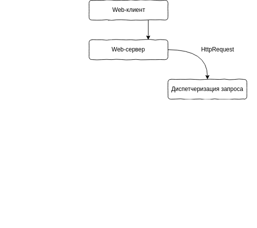

# 

## Web-разработка на батарейках.

* Где взять: https://www.djangoproject.com/
* Документация: https://docs.djangoproject.com/en/2.0/

###### Шередеко Василий, piphon@gmail.com

---

# Батарейки

- ORM для работы с БД: PostgreSQL, MySQL и SQLite.
- Встроенный шаблонизатор и поддержка шаблонизатора Jinja2.
- Инструменты для валидации пользовательских данных.
- Административный интерфейс.
- Аутентификация пользователя.

---

# Создание проекта

## Виртуальное окружение

```bash
mkvirtualenv --python=`which python3` example
```

---

# Создание проекта

## Устанавливаем Django

```bash
pip install Django
```

---

# Создание проекта

## Создаем проект Django

```bash
django-admin startproject example
```

---

# Структура проекта


---

# Структура проекта


---

# Структура проекта


---

# Структура проекта


---

# Структура проекта


---

# Консольные команды

## Список команд

```bash
python manage.py
```

---

# Консольные команды

## Запуск Web-сервера

```bash
python manage.py runserver
```

---

# Консольные команды

## Обновление таблиц в базые данных

```bash
python manage.py migrate
```

---

# Консольные команды

## Создание пользователя для админки

```bash
python manage.py createsuperuser
```

---

# Консольные команды

## Интерактивная консоль

```bash
python manage.py shell
```

---

# Консольные команды

## Интерактивная консоль базы данных

```bash
python manage.py dbshell
```

---

# Создание приложения Django

##

```bash
python manage.py startapp catalog
```

---

# Структура приложения


---

# Структура приложения


---

# Структура приложения


---

# Структура приложения


---

# Структура приложения


---

# Структура приложения


---

# Список приложений

Добавим новое предложение настройку `INSTALLED_APPS`

```python
INSTALLED_APPS = [
    ...,

    'catalog'
]
```

---

# Настройки прокета Django

- `DEBUG` - показывать отладочную информацию при ошибках.
- `ALLOWED_HOSTS` - под какими доменами работает сайт в продакшене.
- `INSTALLED_APPS` - установленные Django-приложения 
- `LANGUAGE_CODE` - язык проекта
- `USE_I18N` и `USE_L10N` - для локализация и интернационализация

---

# Обработка запросов


---

# Обработка запросов


---

# Обработка запросов



---

# Обработка запросов


---

# Обработка запросов


---

# Обработка запросов


---

# Обработка запросов


---

# Обработка запросов


---

# Обработка запросов


---

# Наша первая страница: вид

## `views.py`

Обработка HTTP запроса и возвращаем

```python
from django.http import HttpRequest, HttpResponse

def home(request: HttpRequest) -> HttpResponse:
    return HttpResponse(
        '<b>Hello world!</b>', content_type='text/html'
    )
```

---

# Наша первая страница: URL

## `urls.py`

```python
...
from catalog import views

urlpatterns = [
    path('/', views.home)
    ...
]
```

---

# Наша первая модель: описание

```python
from django.db import models

class Article(models.Model):
    name = models.CharField()
    content = models.TextField()
```

--- 

# Наша первая модель: БД

```bash
python manage.py makemigrations catalog
```

```bash
python manage.py migrate
```

--- 

# Наша первая модель: админка

```
from django.contrib import admin
from catalog.models import Article


class ArticleAdmin(admin.ModelAdmin):
    pass

admin.site.register(Article, ArticleAdmin)

```

--- 

# Наша первая модель: вид

```python
def home(request):
    article = Article.objects.get(pk=1)
    
    return HttpResponse(
        f'<title>{ article.title }!</title>'
        f'<b>{ article.content }!</b>', 
        content_type='text/html'
    )
```
